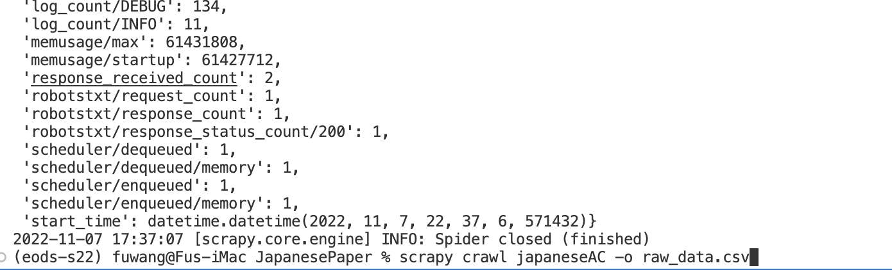

# Instructions on how to using web crawing script

Required Package: **Scrapy**

To install Scrapy using conda, run:
```
conda install -c conda-forge scrapy
```
Alternatively, if you’re already familiar with installation of Python packages, you can install Scrapy and its dependencies from PyPI with:
```
pip install Scrapy
```

To get raw data output as CSV format: Open Terminal, get into the working directory of JapanesePaper 
```
cd /Users/user_name/Documents/WebScraper/JapanesePaper
```
then type in: 

```
scrapy crawl japaneseAC -o dataset_name.csv
```
Like the below image:


[](demo.jpg)


